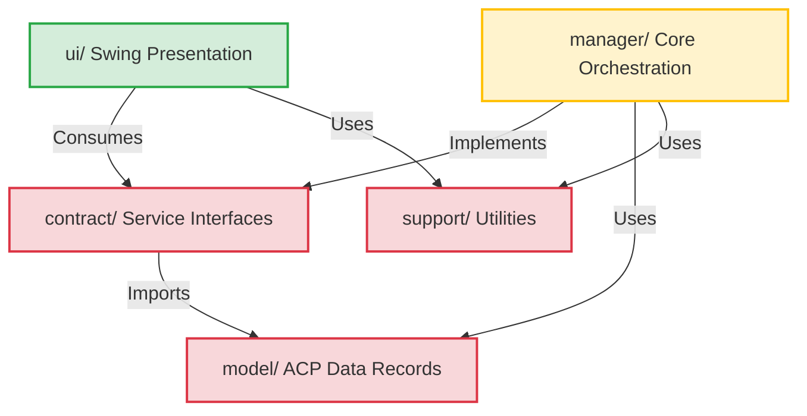

# Architectural Design Review: NetBeans Coding Assistant Plugin

This document provides a detailed architectural review of the **Coding Assistant** NetBeans IDE plugin (v1.9.0). The plugin bridges the NetBeans Platform with an AI subprocess using the **Agent Client Protocol (ACP) v1** via JSON-RPC over stdin/stdout and Server-Sent Events (SSE) streaming.

---

## 1. Architectural Summary & Strengths

The codebase implements a mature **Hexagonal (Ports & Adapters)** design style customized for the NetBeans rich-client module environment. Below is a structural mapping of how dependencies flow and how components interface:

### Layered Architecture & Dependency Flow



### Key Architectural Strengths

| Design Aspect | Implementation | Benefits |
|---|---|---|
| **Hexagonal Isolation** | Direct presentation (`ui/`) -> logic (`manager/`) dependencies are banned. The UI interacts only with `contract/` interfaces. | High testability; logic/protocol swaps can be done without modifying the Swing components. |
| **Loose Platform Coupling** | NetBeans lookup APIs (`Lookup.getDefault()`), preferences, and project managers are abstracted behind the `PlatformBridge` adapter interface. | Swing UI views and message dispatchers can run in headless/unit testing environments by mocking `PlatformBridge`. |
| **Lookup Injection** | Replaced concrete singletons (`SessionManager.getInstance()`) with service provider registration mapped via NetBeans `Lookup`. | Eliminates static state and enforces compile-time boundary constraints. |

---

## 2. Asynchrony, Concurrency & EDT Safety

In Swing applications, managing background processes (like the `opencode acp` execution) without freezing the UI thread (Event Dispatch Thread - EDT) is a critical requirement. The plugin employs several robust concurrency guards:

### The SSE $\rightarrow$ EDT Session Race Guard
When streaming message updates (e.g., `agent_message_chunk` or `tool_call`) from an SSE endpoint, network latency can mean chunks arrive after a user has switched to a different session.
- **Guard Mechanism**: `SessionLifecycleHandler.displayMessage()` captures the active session ID *before* scheduling the EDT callback using `SwingUtilities.invokeLater()`.
- **Validation**: Once execution enters the EDT task, it re-verifies the session ID against the current session. Stale updates from inactive sessions are silently dropped, preventing message bleed across conversations.

### Debounced New Session Toolbar
To prevent double-click button actions from spawning multiple concurrent session initialization tasks on the server:
- The toolbar uses a **300ms debounce timer**.
- Quick keyboard commands (e.g., `Ctrl+L`) bypass this filter for immediate responsiveness, maintaining a high-performance feel.

---

## 3. UI Rendering & Performance Optimizations

Updating rich Swing components (specifically `JTextPane` and layout trees) during rapid SSE streaming is computationally expensive. The plugin implements a multi-tier rendering strategy:

```
                  ┌────────────────────────────────────────┐
                  │          Incoming Markdown             │
                  └──────────────────┬─────────────────────┘
                                     │
                    Is it streaming tool/thought text?
                    ├── Yes ──> [MarkdownStyledRenderer]
                    │           • Bypasses HTML engine
                    │           • Inserts ranges via SimpleAttributeSet
                    │           • Extremely fast, zero layout rebuilds
                    │
                    └── No ───> [FitEditorPane] (Full Bubble)
                                • Renders complete HTML/CSS
                                • Reuses Document (doc.remove() + kit.read())
                                • LRU Caching for markdown conversion (<32KB)
```

1. **`MarkdownStyledRenderer` (Fast & Lightweight)**: Used for streaming thoughts, tool activity, and raw logs. Bypasses Swing's native HTML engine entirely, parsing tokens directly into a `JTextPane` with `SimpleAttributeSet`.
2. **`FitEditorPane` (Heavy & High-fidelity)**: Reserved for finalized chat bubbles requiring nested list indentation, code highlights, and links. Reuses the underlying HTML document object rather than rebuilding layout trees.
3. **Coalesced Stream Flushing**: Streaming updates are stored in a buffer and flushed every `TimingConstants.STREAM_FLUSH_MS` (300ms) to ensure smooth animations without flooding the EDT layout queue.

---

## 4. Memory Management & Lifecycle Cleanup

Memory leaks are a common failure point for long-running IDE components. The design addresses this with the following contracts:
- **Timer and Stream Disposal**: Overridden `removeNotify()` calls in UI components explicitly stop Swing `Timer` instances and finalize streaming buffers.
- **Persistent MouseListeners**: In `BaseCollapsiblePane`, listeners capturing `this` references are intentionally kept in memory as they die naturally with the component tree, preventing duplication bugs during UI refresh cycles.

---

## 5. Architectural Recommendations & Opportunities

While the architecture is highly decoupled and performant, the following areas present opportunities for refinement:

> [!TIP]
> **Single-Threaded JSON-RPC Client**: The `AcpProtocolClient` uses blocking stream reads on standard input/output. Consider moving to a non-blocking framework or thread pool if network throughput scales.
>
> **Pre-compiled Regex Patterns**: The plugin uses pre-compiled `static final Pattern` matches in hot paths (avoiding `String.matches()`). Extending this pattern to text-parsing utils would further reduce GC pressure during long chat streams.
