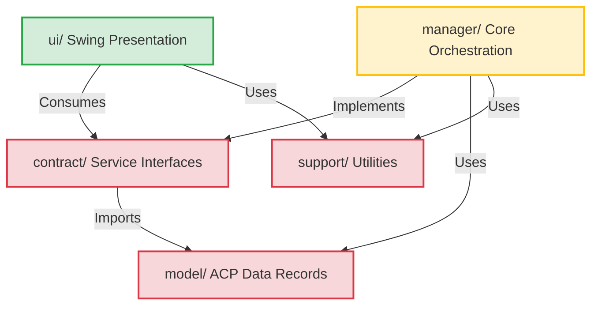

# Architectural Design Review: NetBeans Coding Assistant Plugin

This document provides a detailed architectural review of the **Coding Assistant** NetBeans IDE plugin (v1.16.x, artifactId `beanbot`). The plugin bridges the NetBeans Platform with an AI subprocess using the **Agent Client Protocol (ACP) v1** via JSON-RPC over stdin/stdout and Server-Sent Events (SSE) streaming. It also exposes an embedded **MCP (Model Context Protocol) server** so the AI can call back into the IDE.

---

## 1. Architectural Summary & Strengths

The codebase implements a mature **Hexagonal (Ports & Adapters)** design style customized for the NetBeans rich-client module environment. Below is a structural mapping of how dependencies flow and how components interface:

### Layered Architecture & Dependency Flow


```mermaid
graph TD
    UI[ui/ Swing Presentation] -->|Consumes| Contract[contract/ Service Interfaces]
    UI -->|Uses| Support[support/ Utilities]
    
    Manager[manager/ Core Orchestration] -->|Implements| Contract
    Manager -->|Uses| Model[model/ ACP Data Records]
    Manager -->|Uses| Support
    
    Contract -->|Imports| Model
    
    classDef high fill:#d4edda,stroke:#28a745,stroke-width:2px;
    classDef mid fill:#fff3cd,stroke:#ffc107,stroke-width:2px;
    classDef low fill:#f8d7da,stroke:#dc3545,stroke-width:2px;
    
    class UI high;
    class Manager mid;
    class Contract,Model,Support low;
```

### Key Architectural Strengths

| Design Aspect | Implementation | Benefits |
|---|---|---|
| **Hexagonal Isolation** | Direct presentation (`ui/`) -> logic (`manager/`) dependencies are banned. The UI interacts only with `contract/` interfaces. | High testability; logic/protocol swaps can be done without modifying the Swing components. |
| **Loose Platform Coupling** | NetBeans lookup APIs (`Lookup.getDefault()`), preferences, and project managers are abstracted behind the `ui/platform/PlatformBridge` adapter and its sub-services (`SessionService`, `ProcessService`, `PrefStore`, `Bundle`, `ProjectContext`), resolved via `@ServiceProvider` + `*Safe()` fallback proxies. | Swing UI views and message dispatchers can run in headless/unit testing environments; platform services are swappable. Note: this seam is *partially* adopted — many `ui/` call sites still use `Lookup.getDefault().lookup(SessionControl.class)` / `NbPreferences` directly, with full migration deferred. |
| **Lookup Injection** | Concrete managers are registered as `@ServiceProvider` behind `contract/` interfaces and resolved via NetBeans `Lookup`. | Eliminates UI static coupling and enforces compile-time boundary constraints. (`SessionManager` retains a `getInstance()` legacy accessor used by tests, but the UI consumes it via `SessionControl`.) |

---

## 2. Asynchrony, Concurrency & EDT Safety

In Swing applications, managing background processes (like the `opencode acp` execution) without freezing the UI thread (Event Dispatch Thread - EDT) is a critical requirement. The plugin employs several robust concurrency guards:

### The SSE $\rightarrow$ EDT Session Race Guard
When streaming message updates (e.g., `agent_message_chunk` or `tool_call`) from an SSE endpoint, network latency can mean chunks arrive after a user has switched to a different session.
- **Guard Mechanism**: `SessionLifecycleHandler.displayMessage()` captures the active session ID *before* scheduling the EDT callback using `SwingUtilities.invokeLater()`.
- **Validation**: Once execution enters the EDT task, it re-verifies the session ID against the current session. Stale updates from inactive sessions are silently dropped, preventing message bleed across conversations.

### Debounced New Session Toolbar
To prevent double-click button actions from spawning multiple concurrent session initialization tasks on the server:
- The toolbar uses a **300ms debounce timer** (`ChatLayoutBuilder.newSessionDebounceTimer`).
- The `Ctrl+L` shortcut is **not** related to New Session — it toggles the assistant sidebar via `ToggleAssistantAction` (see Section 5). The debounce applies only to the New Session toolbar button.

---

## 3. UI Rendering & Performance Optimizations

Updating rich Swing components (specifically `JTextPane` and layout trees) during rapid SSE streaming is computationally expensive. The plugin implements a multi-tier rendering strategy:

```
                  ┌────────────────────────────────────────┐
                  │          Incoming Markdown             │
                  └──────────────────┬─────────────────────┘
                                     │
                    Is it streaming tool/thought text?
                    ├── Yes ──> [MarkdownStyledRenderer]
                    │           • Bypasses HTML engine
                    │           • Inserts ranges via SimpleAttributeSet
                    │           • Extremely fast, zero layout rebuilds
                    │
                    └── No ───> [FitEditorPane] (Full Bubble)
                                • Renders complete HTML/CSS
                                • Reuses Document (doc.remove() + kit.read())
                                • LRU Caching for markdown conversion (<32KB)
```

1. **`MarkdownStyledRenderer` (Fast & Lightweight)**: Used for streaming thoughts, tool activity, and raw logs. Bypasses Swing's native HTML engine entirely, parsing tokens directly into a `JTextPane` with `SimpleAttributeSet`.
2. **`FitEditorPane` (Heavy & High-fidelity)**: Reserved for finalized chat bubbles requiring nested list indentation, code highlights, and links. Reuses the underlying HTML document object rather than rebuilding layout trees.
3. **Two-tier stream flushing**: `StreamingCoordinator` drives per-bubble streaming updates, flushing each active `MessageBubble` every `TimingConstants.STREAM_FLUSH_MS` (300ms) via a repeating `Timer`. Independently, `ChatThreadPanel.flushTimer` is a *non-repeating* debounced finalization timer (300ms) that calls `stopStreaming()` when no new chunks arrive (an idle-gap end-of-turn path). Markdown→HTML conversion uses a **Caffeine** cache (`maximumSize(256)`, 60-min expiry) in `HtmlContentPreparer`, plus a small wrapper cache (max 32) for reusable HTML shells; content larger than ~32 KB bypasses caching.

---

## 4. Memory Management & Lifecycle Cleanup

Memory leaks are a common failure point for long-running IDE components. The design addresses this with the following contracts:
- **Timer and Stream Disposal**: Overridden `removeNotify()` calls in UI components explicitly stop Swing `Timer` instances and finalize streaming buffers.
- **Persistent MouseListeners**: In `BaseCollapsiblePane`, listeners capturing `this` references are intentionally kept in memory as they die naturally with the component tree, preventing duplication bugs during UI refresh cycles.

---

## 5. IDE Integration & Context Actions

Beyond the chat panel, the plugin exposes a growing set of IDE context actions that route selection context into the assistant:

- **`ui/AssistantTarget` (router)**: A single seam that decides where "Send to Assistant" / "Ask Assistant" actions deliver their payload. Based on the cached `MINI_ASSISTANT_ENABLED` preference (`support/PluginSettings`), it either opens the floating `MiniAssistantDialog` or the main `AssistantTopComponent` sidebar. This keeps the target decision testable and avoids scattering `PluginSettings` lookups across every action.
- **Context actions (`ui/SendToAssistantEditorAction`, `SendToAssistantFileAction`, `InspectorContextMenu`, `TestResultsContextMenu`)**: All actions follow the same contract — extract the selection/file subtree, then call `AssistantTarget.showWithText(...)`. The actions are gated behind the shared "Enable context menu additions" preference. `TreePopupSupport` centralizes the copy/send popup behavior shared by the Inspector and Test Results windows.
- **Append semantics**: `showWithText` *appends* to the input area (`AssistantTopComponent.appendInputText`) rather than overwriting, so multiple selections accumulate before the user sends — an important behavioral contract for the UI layer.
- **`ui/AssistantTarget` send flow**: When the mini dialog is the target, the text is appended to its own input area via `MiniAssistantDialog.showWithText`, keeping the two entry points behaviorally consistent.
- **Missing-binary state (`ui/MissingBinaryBubble`)**: When `BinaryResolver` reports the `opencode` binary is absent, the chat shows an OS-specific install command with a copy button, a setup-guide link, a restart button, and an "Open Settings" button; the toolbar restart button pulses via the attention animation system in `AssistantTopComponent`, and "New Session" stays disabled until a successful server start. This state is owned centrally by `AssistantTopComponent.setBinaryNotFoundState()`.

### Ctrl+L Toggle & Window Registration
`Ctrl+L` toggles the assistant sidebar. This depends on a specific combination that must not be broken: the `AssistantTopComponent` `@TopComponent.OpenActionRegistration` annotations plus a manual `layer.xml` registration pointing both the `Window > Assistant` menu entry (`Assistant.shadow`) and the `Ctrl+L` shortcut (`D-L.shadow`) at `ToggleAssistantAction` (which uses `findInstance()` + `toggleVisibility()`). No `KeyEventDispatcher` intercepts Ctrl+L.

---

## 6. MCP Server (Calling the IDE from the AI)

The plugin embeds a **Model Context Protocol (MCP) server** so the AI subprocess can invoke IDE operations back on the host:

- **`mcp/McpServer`**: A Jetty-based HTTP server bound to `localhost` on a random port, secured by a bearer token. Started/stopped by `mcp/McpManager` (async startup with capability detection and a disable toggle).
- **Tool registry (`mcp/McpTools`, `McpToolDefinition`, `McpToolAdapter`)**: Tools are registered/unregistered in a thread-safe registry. `McpToolAdapter` adapts `McpManager` to the `contract/ToolExecutor` port, keeping `manager/` from depending on `mcp/`.
- **Tool providers**: `EditorToolProvider` (`get_opened_files`, `open_file_at_line`, `rename_session`), `ProjectToolProvider`, and `StashDiffToolProvider` register the IDE tool set.
- **Transport (`mcp/MessageServlet`)**: Handles protocol messages. MCP tool names are capped at 14 characters.

---

## 7. Project Lifecycle, Process & Session Management

- **`project/ACPStartup`** (`@OnStart`): Defers heavy initialization (preferences migration, update-check start, sidebar open, version-change detection) to a background thread to avoid blocking plugin install. **`project/ACPShutdown`** (`@OnStop`) stops the process control and the image-paste I/O pool. **`project/ACPProjectManager`** caches the open-project list and updates it on open/close events.
- **Process/session (`manager/`)**: `ServerProcessLifecycle` owns start/stop (with WSL support); `SessionStateMachine` drives IDLE → LOADING → STREAMING → STOPPING → IDLE; `AcpReconnectManager` auto-reconnects (3 attempts, linear 3s/6s/9s backoff); `AcpRequestRouter` routes requests to the server.
- **Request timeouts**: Use per-request *idle* timeouts tied to the connection's `lastDataTime` rather than absolute deadlines (`future.orTimeout`), so in-flight requests survive active streaming. Exception: the `initialize` request during startup may use an absolute timeout since it must complete before streaming begins.
- **`manager/strategy/StrategyRegistry`**: Dispatches `session/update` messages to handler strategies (implements `contract/UpdateDispatcher` via `@ServiceProvider`), with a Caffeine cache for tool-call deduplication.

---

## 8. Supporting Services, State & Persistence

- **Configuration (`support/GlobalOpencodeConfig`)**: Manages `~/.config/opencode/opencode.json`, evaluating config state (REAL_CONTENT / NEEDS_SETUP / UNPARSEABLE), surfaced to the user via `ui/GlobalConfigBubble`. **`support/PreferencesMigrator`** migrates preferences from prior user directories. `ui/ACPOptionsPanel`, `ui/ConfigPanelController`, `ui/PreambleDialog`, and `ui/ModelVariantResolver` expose IDE options, session preamble, and model-variant selection.
- **Slash commands**: `contract/SlashCommandProvider` + `manager/DefaultSlashCommandInterceptor` route `/models`, `/model`, `/agents`, `/level`, `/sessions`, `/new`, `/title`, `/archive`, `/compact`. (Injected via `Lookup` for the `contract/` → `manager/` seam.)
- **File & session caches**: `manager/FileCacheManager` (implements `contract/FileCacheQuery`), eagerly initialized by `FileCacheInitializer`, with VCS ignore strategies (`GitIgnoreStrategy`, `HgIgnoreStrategy`, `NoVcsIgnoreStrategy`); `manager/SessionCacheManager` caches session data.
- **State & messaging**: `manager/PinnedMessageStore` (in-memory + `NbPreferences`-persisted, `contract/PinnedMessageControl`); `agent_title`/`sub_agent` display via `manager/strategy/SubAgentTitleResolver`; **`support/Logger`** is a session-aware, timestamped logging wrapper; **`support/PreferenceKeys`** centralizes preference constants (resolving the old `ui/` → `manager/` preference-key coupling).
- **Update checking**: `manager/UpdateCheckerService` (`contract/UpdateCheckerControl`) checks Maven Central in the background (60s delay, 24h interval), dispatched off the EDT via a background request pool.
- **Image paste**: `ui/ImagePasteTransferHandler` (Wayland clipboard support) delegates its I/O thread pool to `support/ImagePasteIoProcessor` (a `RequestProcessor`), keeping I/O off the EDT.
- **Export & history**: `ConversationExporter` (Markdown) and `HtmlConversationExporter` (standalone HTML with embedded CSS); `MessageHistory` + `HistorySearchDialog` (NbPreferences-persisted input history, `Ctrl+Up`); `ArchiveSessionAction`.

---

## 9. UI Permissions, Attachments & Actions

- **Permission flow (`ui/PermissionBubble`, `PermissionRequestPanel`, `PermissionOption`, `PermissionDialogManager`, `AllowPermissionAction`, `contract/PermissionHandler`)**: Renders and resolves AI permission requests (allow/deny/always).
- **Attachments (`ui/AttachmentManager`, `AttachmentUiHandler`, `AttachmentBadgeIcon`)**: File attachment support wired through the chat input.
- **Single-bubble rendering**: `ui/BubbleFactory`, `BubbleThemeApplier`, `BubbleContentRenderer`, `BubbleStreamer`, `MessageBubble`, and the collapsible panes (`BaseCollapsiblePane`, `CollapsibleActivityPane`, `CollapsibleCodePane`, `CollapsibleToolPane`, `AccordionGroup`, `BubbleAccordionManager`) form the chat-turn rendering stack. `MessageFilterManager`/`TypeFilterApplier` and `ToolThoughtCombiner` shape streamed output.
- **Surface features**: `ui/WelcomeScreen` (session list when none loaded), `StatusController` (status bar + thinking animation), `GoToFileDialog` (Ctrl+J, debounced search), `TokenUsageDialog`, `KeyboardShortcutsDialog`, `ArchiveSessionAction`, and 20+ toolbar/menu action classes (`NewSessionAction`, `RenameSessionAction`, `ReloadSessionAction`, `RestartServerAction`, `StopMessageAction`, `SendMessageAction`, `SearchWebAction`, `CompactJsonAction`, sort-lines actions, `AskAssistantRefactorAction`, ...).
- **`ui/mdproject/`**: A secondary Markdown project template/wizard the plugin registers.

---

## 10. Architectural Recommendations & Opportunities

While the architecture is highly decoupled and performant, the following areas present opportunities for refinement:

> [!TIP]
> **Complete the `ui/platform/PlatformBridge` migration**: Many `ui/` call sites still use `Lookup.getDefault().lookup(SessionControl.class)` / `NbPreferences.forModule(...)` directly instead of the bridge sub-services. Finishing this removes scattered lookups and tightens testability.
>
> **Retire legacy singleton accessors**: `SessionManager.getInstance()` remains for test compatibility. Migrating tests to Lookup-backed resolution removes the last concrete-singleton path.
>
> **Single-Threaded JSON-RPC Client**: The `AcpProtocolClient` uses blocking stream reads on standard input/output. Consider moving to a non-blocking framework or thread pool if network throughput scales.
>
> **Pre-compiled Regex Patterns**: The plugin uses pre-compiled `static final Pattern` matches in hot paths (avoiding `String.matches()`). Extending this pattern to text-parsing utils would further reduce GC pressure during long chat streams.
