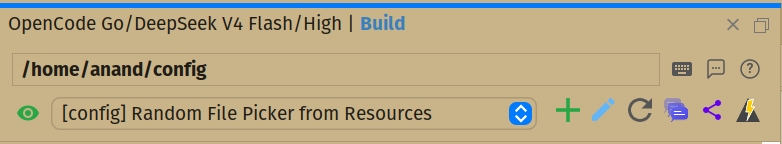
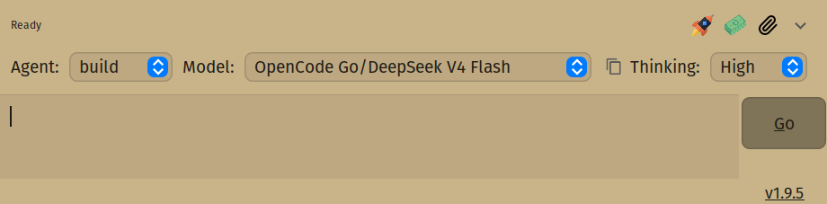
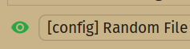
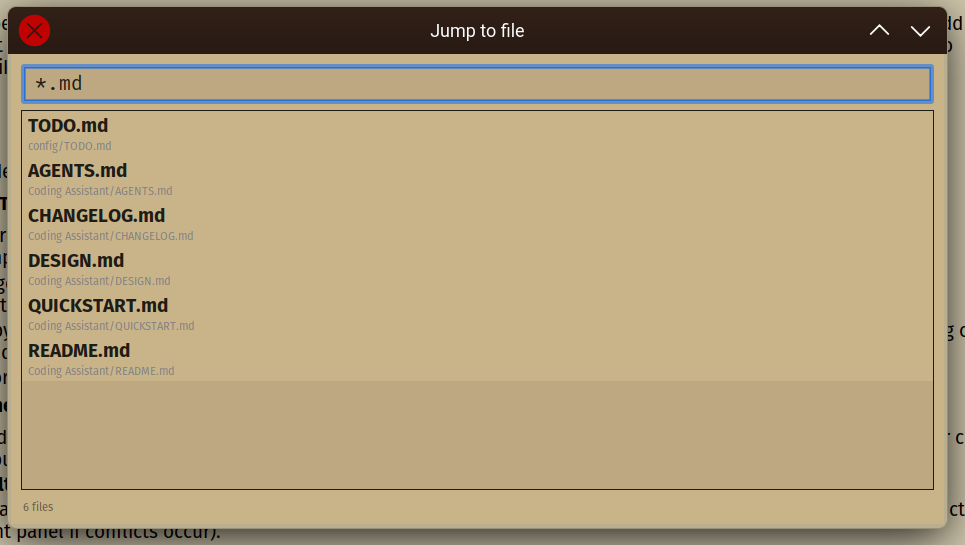

# QuickStart Guide

**BeanBot/Coding Assistant** is a NetBeans plugin that provides an AI assistant panel powered by [OpenCode](https://opencode.ai/).
  It communicates with OpenCode over ACP (Agent Client Protocol), running it as a background server so you can chat
  with AI models directly inside the IDE.

## Table of Contents

- [Setup](#setup)
- [Features](#features)
  - [Starting a session](#starting-a-session)
  - [Picking an Agent, Model and Thinking Level](#picking-an-agent-model-and-thinking-level)
  - [Showing all messages](#showing-all-messages)
  - [Exporting a conversation](#exporting-a-conversation)
  - [Copying a message](#copying-a-message)
  - [Commands](#commands)
  - [Selecting toolbar buttons](#selecting-toolbar-buttons)
  - [Archiving Sessions](#archiving-sessions)
  - [Restarting the server](#restarting-the-server)
  - [Renaming the session](#renaming-the-session)
  - [Check token usage](#check-token-usage)
  - [Filtering Chat Messages](#filtering-chat-messages)
  - [Resetting context limits (/compact)](#resetting-context-limits-compact)
  - [Attachments](#attachments)
  - [Permission Requests](#permission-requests)
  - [Keyboard Shortcuts](#keyboard-shortcuts)
  - [Message History](#message-history)
  - [Chat Features](#chat-features)
    - [Time to first token](#time-to-first-token)
    - [Thinking and Tool Responses](#thinking-and-tool-responses)
  - [Assistant Options](#assistant-options)
  - [IDE Enhancements](#ide-enhancements)
- [Experiments](#experiments)
  - [Manage OpenCode Config in NetBeans](#manage-opencode-config-in-netbeans)
  - [Git Stashes as "Code Drafts" (using Stash Diff)](#git-stashes-as-code-drafts-using-stash-diff)
  - [Completely Offline/Private Coding (Local LLMs)](#completely-offlineprivate-coding-local-llms)
  - [Local Data Analysis in Java](#local-data-analysis-in-java)
  - [Mockups to Functional Swing Code (Matisse Integration)](#mockups-to-functional-swing-code-matisse-integration)
- [Known Issues](#known-issues)
- [Troubleshooting](#troubleshooting)

---

## Setup

### 1. Install OpenCode

The plugin relies on the OpenCode CLI (`opencode`) running as a background server. You must install OpenCode on your system first. For complete and up-to-date installation instructions, please refer to the [OpenCode Documentation](https://opencode.ai/docs/).

**Installation Methods:**
- **macOS / Linux (Recommended):** Run the install script in your terminal:
  ```bash
  curl -fsSL https://opencode.ai/install | bash
  ```
- **NPM (Global):**
  ```bash
  npm install -g opencode-ai
  ```
- **Homebrew (macOS):**
  ```bash
  brew install anomalyco/tap/opencode
  ```
- **Windows:** It is highly recommended to run OpenCode inside **WSL (Windows Subsystem for Linux)** for the best performance and compatibility. You can also use Chocolatey (`choco install opencode`) or Scoop (`scoop install opencode`).

**Configure AI Providers:**
Once installed, you need to connect an AI provider (unless you only plan to use the free models).
1. Open a terminal and run `opencode auth login` or launch the TUI and type `/connect` to add your API keys.
2. If you want to use local models (like Ollama), ensure they are running and accessible on your local machine.

**Verify your installation:**

1. Open a terminal and navigate to your project directory.
2. Run `opencode .` to launch the OpenCode TUI (terminal-based interface).
3. Confirm you can interact with your configured providers (type `/models` to select a model).
4. If the `opencode` command is not found, ensure it was added to your system `PATH` and restart your terminal/IDE.

On **Wayland** (Linux), also install the `wl-clipboard` package for image paste support to work inside the plugin.

### 2. Install the Plugin

You can install the plugin directly from the NetBeans plugin catalogue by navigating to `Tools > Plugins > Available Plugins` and searching for it.

However, for the latest version, you can download the `.nbm` file directly from [Maven Central](https://central.sonatype.com/artifact/io.github.anandb/beanbot/versions), then navigate to `Tools > Plugins > Downloaded` in NetBeans and add the `.nbm` file manually.

### 3. Open the Assistant

Open the interface via `Window > Assistant` or the keyboard shortcut `Ctrl + L`.

### 4. Configure the Binary Path

The plugin auto-detects the OpenCode binary on your system `PATH`. To
override, set the path manually under `Options > Assistant`.

### 5. Set a Preamble (Optional)

Define a global prompt in `Options > Assistant > Preamble`. This is
added to every new session alongside your OpenCode agent prompts. An example
comes out of the box, you can change it to suit your needs.

---

## Features

### Starting a session

Click the '+' button on the toolbar to start a new session, this will initialize the chat interface and post the preamble to the OpenCode server (Tools > Options > Assistant > Preamble). The input text-area is at the bottom of the sidebar panel, you'll see placeholder text that says *Type Message Here*, type your messages and press `Enter` to send to the server, the response will be rendered as a chat bubble, if you need to send multi-line text, press `Shift + Enter` to add a newline to the text-area. You can also type `/new` in the input area to quickly start a new session.



### Picking an Agent, Model and Thinking Level

Hitting `Tab` when in the input text-area or pressing the small gear icon, will slide open the chat options panel, by default you'll see two agents build and plan, OpenCode also allows custom agents to be defined, pick one of the models supported by the providers you have configured, and a suitable Thinking Level, the actual levels displayed depend on the exact model selected. The gear would have turned into a down arrow button, click the button to close the options panel. You can also use the `/agents`, `/models`, and `/level` slash commands to open these selectors.



### Showing all messages

By default, older messages are gradually hidden from the chat panel to conserve memory, to always show all messages, click the 'Show All Messages' button on the toolbar, and then click Reload, the session will be reloaded but all the messages will be retained. If you wish to retain just one or two messages for quick reference such as a plan or to-do list, hovering over the response bubble will show a copy and a pin button, the pin will keep the message in the chat panel, it won't be cleared with time.

### Exporting a conversation

The share button on the toolbar will export the session to a markdown file.

### Copying a message

You can copy individual user messages back into the input text-area. Hover over the user icon, it'll change into a copy button — clicking it copies the message to the clipboard and adds it to the input text-area so you can resend or edit it. Assistant responses can be copied by hovering over the bubble, you'll see a copy and a pin button, copy will copy to the clipboard.

### Commands

Slash commands let you perform quick actions directly from the chat input. Type `/` in the input area to trigger the autocomplete popup. You can use `/new` to create a new session, `/models` to choose a different AI model, `/agents` to select an agent, and `/level` to configure the thinking budget. Other commands include `/sessions` to switch between active chats, `/compact` to summarize and condense the message history when approaching context limits, and `/title` to have the AI suggest and apply a new name for the current session.

### Selecting toolbar buttons

You can customize your workspace by choosing which toolbar buttons are visible. Right-click anywhere on the toolbar to bring up a context menu where you can show or hide individual buttons. The toolbar provides quick access to actions like starting a session, viewing this guide, opening keyboard shortcuts, checking token usage, restarting the server, and exporting conversations. You can adjust the size of these icons in `Options > Assistant > Appearance`.

### Archiving Sessions

Keep your active session list clean by archiving old conversations instead of deleting them. You can archive a session by opening the session dropdown and right-clicking the session name, then selecting Archive. This hides it from the default dropdown list but keeps it saved on the server. You can toggle the visibility of archived sessions by clicking the eye icon in the session dropdown menu.



### Restarting the server

If the assistant becomes unresponsive or you experience connection issues, you can restart the underlying OpenCode background server. Click the **Restart ACP Server** button in the toolbar. This will safely terminate the current background process and spin up a new one, reconnecting your IDE without losing your saved sessions.

### Renaming the session

To keep your conversations organized, you can rename any session. Click the **Pencil icon** in the chat UI or right-click a session in the session dropdown to give it a custom name. Alternatively, type the `/title` slash command to let the AI automatically generate and apply a suitable title based on the conversation context. These custom names are stored locally by the plugin, not in the OpenCode DB.

### Check token usage

Click the **Currency/Token Stats** icon on the toolbar to see how many tokens your current session has used. Hover over the status label (which normally says "Ready") to view the context window fill level. This helps you decide when to run `/compact` to summarize the conversation and free up context.

### Filtering Chat Messages

To reduce clutter in your chat history, you can selectively show or hide different message types using the **Filter** button on the toolbar. Clicking this button opens a dropdown menu allowing you to toggle the visibility of:
*   **Activity**: Hides or shows tool outputs and internal model reasoning chains together.
*   **Assistant**: Hides or shows the assistant's responses.
*   **User**: Hides or shows your own messages.

If the option to combine tools and thoughts is disabled in your settings, the menu will dynamically update to show individual checkboxes for **Tool** outputs and **Thought** reasoning. Your filter choices are instantly applied to the active chat thread and are automatically saved so they persist across NetBeans IDE restarts.

### Resetting context limits (/compact)

If your conversation becomes very long and you notice the AI starting to forget earlier details or slow down as it approaches its context token limits, you can reset the conversation context. Type the `/compact` command in the chat input. The assistant will summarize the history, code changes, and context discussed so far, replacing the verbose message history with a highly condensed summary. This resets the active token budget while preserving the essential goals and context of the thread.

### Attachments

You can attach files and images to provide more context to the AI. Click the **Paperclip icon** in the input area to open the attachment menu. The plugin also supports dragging and dropping files directly into the chat, as well as pasting screenshots straight from your clipboard (provided you are using a vision-capable model).

### Permission Requests

When the AI attempts to execute a tool, modify files, or run shell commands, the plugin ensures you remain in control. An Accept/Deny bubble will appear in the chat with full context of the requested action. You must explicitly grant permission before the operation proceeds. You can configure automatic allowances or denials in your OpenCode configuration.

### Keyboard Shortcuts

Navigate and control the assistant efficiently using keyboard shortcuts. Press `Ctrl + L` to open or switch focus to the assistant panel. Use `Alt + Up / Down` to cycle through previously sent messages, `Page Up / Down` to scroll the chat, and `Ctrl + R` to search message history. You can also open the Jump to File dialog with `Ctrl + Alt + J` (or `Cmd + Option + J` on Mac) and trigger the Stash Diff viewer with `Ctrl + Shift + L`. Press `Escape` to close the options panel.

### Message History

Your complete message history is always safely stored on the server. While the local chat view might hide older messages ("Forget") to conserve IDE memory, you can always retrieve the full history by clicking **Show All Messages** followed by **Reload**. You can also search through your past input history using `Ctrl + R`.

### Chat Features

#### Time to first token
The status bar at the bottom of the assistant panel keeps you informed of the AI's progress. It will display states like `Ready`, `Thinking...`, and `Responding...`. The plugin optimizes for speed, reducing the time to first token so you can see responses being streamed immediately.

#### Thinking and Tool Responses
Advanced models use a "thinking" budget to reason before responding. This internal reasoning is displayed in its own collapsible pane. Similarly, when the AI uses tools, the tool output is shown in collapsible panes marked with a tag icon. You can use the **Filter** button to hide these thought or tool bubbles from the chat view, or use the **Expand/Collapse All** button to manage them all at once. Error messages will appear as red-tinted bubbles, and tables are rendered cleanly with alternating row colours.

### Assistant Options

Customize the plugin behavior by navigating to `Tools > Options > Assistant`. Here, you can configure the path to the OpenCode binary, add process arguments, set a global system Preamble for all sessions, and toggle "Local Echo" for instant message rendering. You can also adjust UI preferences like toolbar icon size, chat font size, enable or disable specific features (like Stash Diff or Jump to file), and set a custom user avatar.

Additionally, the plugin includes a background **Update Checker Service** that automatically queries for new releases (with randomized intervals between 16 and 24 hours). You can toggle the update checks under `Tools > Options > Assistant > Check for updates`. When an update is found, you will be prompted with a dialog to download the update immediately, get reminded later, or skip the version entirely.

### IDE Enhancements

The plugin integrates deeply with NetBeans beyond just the chat panel to boost your coding productivity:

*   **Markdown Project Type:**
    *   Allows you to create a minimal project for managing folders of text notes, design files, or markdown documentation without requiring a compiler or build system (e.g., Maven or Gradle).
    *   To create one, go to `Tools > New Project > Other > Markdown Project`. Alternatively, you can run `touch .mdproject` inside any folder to instantly make that directory loadable as a project in NetBeans.
    *   It is identified by a `.mdproject` marker file, and renders a clean directory tree in the NetBeans Projects tab, automatically filtering out OS junk files and editor swap files.
    *   You can close or delete the project directly from the right-click context menu on the project node.
*   **Stash Diff (Experimental):**
    *   A side-by-side diff viewer for git stashes. Select any stash in the NetBeans Git Repository Browser and press `Ctrl + Shift + L` (or click the **Diff Stash** button in the Git toolbar) to open it.
    *   **To Base (default):** Displays stash parent commit vs stash content (equivalent to `git stash show -p`).
    *   **To HEAD:** Simulates a 3-way merge applying the stash on your current HEAD, showing conflict markers inline (with a red "Conflict" label in the right panel if conflicts occur).
    *   **To Working Tree:** Simulates applying the stash onto the working tree, showing unchanged/modified tree status on the left.
    *   **File List & Partial Apply:** Click any file to view its syntax-highlighted diff, or right-click a file to "Apply this change" individually from the stash.
*   **Editor Context Menu Utilities:**
    *   **Search Web:** Right-click selected text (or the word under the cursor) in the editor and click **Search Web** to quickly search Google using your NetBeans-configured web browser.
    *   **Sort Lines Ascending / Descending:** Select multiple lines, right-click, and choose this option to alphabetically sort them.
    *   **Minify JSON:** Right-click any JSON content to quickly strip out all formatting whitespace.
*   **Jump to File Dialog:**
    *   A modeless file search dialog triggered via `Ctrl + Alt + J` (or `Cmd + Option + J` on Mac) that lets you search all open projects by filename prefix, path substring, or glob patterns.
    *   Supports quick keyboard navigation with arrow keys and `Enter` to open.
    *   Powered by an **In-Memory File Indexing Cache** that rebuilds in the background when projects are opened or closed. It automatically respects `.gitignore` rules and ignores common directories like `node_modules/`, `target/`, and `build/`.
    *   Includes incremental live indexing via file system listeners, meaning new, deleted, or renamed files are immediately searchable without full rebuilds.
    *   Can be enabled or disabled under `Tools > Options > Assistant`.

        
---

## Experiments

Here are some interesting things you can try with the plugin:

### Manage OpenCode Config in NetBeans

Since the plugin supports the **Markdown Project** type (which lets you load any folder that has a `.mdproject` file in it), you can use it to manage your OpenCode configuration directly inside the IDE:

1.  Navigate to your OpenCode configuration directory in your terminal:
    *   **Linux/macOS:** `~/.config/opencode` (or `~/.config/opencode-ai`)
    *   **Windows:** `%APPDATA%\opencode`
2.  Create an empty project marker file by running:
    *   `touch .mdproject` (Linux/macOS)
    *   `type nul > .mdproject` (Windows CMD) or `New-Item .mdproject` (PowerShell)
3.  Open NetBeans and go to `File > Open Project`. Navigate to that configuration directory and open it.
4.  You can now manage your configuration directly inside the IDE. Since the files are loaded as a project in NetBeans, you can ask the assistant panel to make changes for you (e.g., "Add a new custom agent config to my opencode.json") instead of editing them manually.

### Git Stashes as "Code Drafts" (using Stash Diff)

Instead of creating temporary branches for minor changes or code drafts, you can save your progress as stashes and use the Stash Diff viewer as a visual sandbox:
1.  Save your experimental code in a stash: `git stash`.
2.  Open the NetBeans Git Repository Browser, select the stash, and press `Ctrl + Shift + L` (or click **Diff Stash** in the toolbar).
3.  Simulate a merge by comparing it against **To HEAD**, or see how it fits with other local changes by comparing it against **To Working Tree**.
4.  If you only want specific changes, right-click files in the diff list and choose **"Apply this change"** to cherry-pick them back into your working tree without applying the entire stash.

### Completely Offline/Private Coding (Local LLMs)

If you have strict privacy requirements or want to avoid API costs, you can run the plugin entirely offline using local LLMs:
1.  Install a local runner like [Ollama](https://ollama.com) and download a coding model (e.g., `ollama run deepseek-coder` or `ollama run qwen2.5-coder`).
2.  Add a configuration block for the local model in your `opencode.json` configuration file. Note that Qwen models might require `--think=false` if configured via Ollama, and a `"reasoningEffort": "none"` entry.
3.  Open the chat options panel (click the gear icon or press `Tab` in the input area) and choose your local model from the dropdown list. All code queries and indexing tasks will now execute locally on your machine.

### Local Data Analysis in Java

You can use the assistant to run quick data processing tasks on local files (like `.csv` or log files) using single-file Java programs and have the results rendered directly in the chat:
1.  **Prepare your Data**: Open a project or create a folder with some tabular data (e.g., `sales.csv`).
2.  **Ask the Assistant to Analyze**: Ask the assistant to write a single-file Java program to analyze this data.
    *   *Prompt:* `"Write a single-file Java program to read sales.csv, calculate the total revenue grouped by category, and print the results as an ASCII table."`
3.  **Execute the Code**: Click **Accept** on the permission prompt to let the assistant write the file (e.g., `SalesAnalyzer.java`) and run it using the Java launcher (e.g., `java SalesAnalyzer.java`).
4.  **View Formatted Output**: Since Java 11+, single-file source code can be run directly using the `java` launcher without manual compilation. Because the plugin renders ASCII tables as formatted HTML tables with alternating row colors, the printed output will display beautifully inside your chat bubble.

### Mockups to Functional Swing Code (Matisse Integration)

You can use the assistant to convert visual UI mockups (screenshots or wireframes) into Java Swing code, and enhance your Matisse GUI forms with custom components:
1.  **Draft a Visual Mockup**: Draw a UI sketch or take a screenshot of a component you want to build.
2.  **Generate the Custom Component**: Drag-and-drop the mockup image into the chat (or use the paperclip icon) and ask the assistant to code it.
    *   *Prompt:* `"Analyze this mockup. Write a custom JComponent called GradientHeaderPanel.java that renders a color gradient background, a title label, and a drop shadow that matches this design."`
3.  **Compile & Palette Import**: Let the assistant write the file, compile your project, and then drag the compiled `GradientHeaderPanel` class directly into the NetBeans **Matisse Palette**.
4.  **Design visually with Matisse**: Open any Swing GUI form (like a `JFrame` or `JPanel`) in Matisse, and drag-and-drop your new custom AI-generated component directly from the Palette onto your form design.
5.  **Hook up the Logic**: In your Matisse form, click the "Source" tab. Share the Matisse-generated class with the assistant and ask it to write the event listeners and backend logic for your visual components:
    *   *Prompt:* `"Help me write the ActionListeners to connect the search button (btnSearch) to fetch results and populate the list model for lstResults."`

### Screenshot-Driven Bug Diagnosis

Use image paste and a vision-capable model to turn screenshots of broken UIs or stack traces into actionable fixes:

1.  **Capture the Bug**: Take a screenshot of a broken UI, an error dialog, a stack trace, or unexpected output.
2.  **Paste into Chat**: Press `Ctrl+V` directly from the clipboard (requires `wl-clipboard` on Wayland; works natively on macOS/Windows). Alternatively, drag-and-drop the image file onto the input area or click the paperclip icon to attach it.
3.  **Ask for Diagnosis**: Send a message describing the problem alongside the screenshot: *Prompt:* `"This error dialog appears when I click Save. Here's the stack trace. What's causing it and how do I fix it?"`
4.  **Get a Fix Recipe**: The vision-capable model (e.g., GPT-4o, Claude 3.5 Sonnet, Mimo V2.5) reads the screenshot, identifies the crash location or rendering issue, and suggests the exact code change needed.
5.  **Apply the Fix**: Ask the assistant write the fix directly.

---

## Known Issues

- The plugin sometimes doesn't respond when using nested agents.
- Switching sessions or reloading the conversation while awaiting a response can cancel the current request.
- Permission requests aren't always relayed by the ACP server, so while the server is waiting for permission, the
messages can timeout, this can be mitigated to some extent by allowing external read operations. This is a sample
snippet from an `opencode.json` configuration.
```json
{
  "permission": {
    "read": {
      "~/.ssh/**": "deny",
      "~/.gnupg/**": "deny",
      "~/.aws/**": "deny",
      "~/.azure/**": "deny",
      "~/.kube/**": "deny",
      "~/.docker/**": "deny",
      "~/.config/gcloud/**": "deny",
      ".env*": "deny",
      "*.pem": "deny",
      "*.key": "deny",
      "*.p12": "deny",
      "*.jks": "deny",
      "*credentials*": "deny",
      "*": "allow"
    },
    "edit": {
      "~/.aws/**": "deny",
      "~/.azure/**": "deny",
      "~/.ssh/**": "deny",
      "~/.gnupg/**": "deny",
      "~/.kube/**": "deny",
      "~/.docker/**": "deny",
      "~/.config/gcloud/**": "deny"
    },
    "bash": {
      "git push*": "ask",
      "rm *credentials*": "deny",
      "rm *.env*": "deny"
    },
    "webfetch": "allow",
    "external_directory": "allow"
  }
}
```

---

## Troubleshooting

| Problem | Solution |
|---------|----------|
| Plugin can't find OpenCode | Ensure `opencode` is on your `PATH`. Set the binary path manually under `Options > Assistant`. |
| Assistant becomes unresponsive | Click **Restart ACP Server** in the toolbar. |
| `Ctrl+L` stops working | Close and reopen the assistant panel from the Window menu. If that doesn't work, restart the IDE. |
| Sidebar doesn't open after install/upgrade | The plugin auto-opens the sidebar on version change. If it doesn't appear, open it from `Window > Assistant`. |
| Image paste doesn't work on Linux | Install the `wl-clipboard` package (Wayland) or check your clipboard manager. |
| Image paste broken after OpenCode upgrade | Upgrade to OpenCode >= 1.17.17 to resolve the breakage introduced in v1.17.13. |
| Model not appearing after upgrade to OpenCode v1.17.9, upgrade plugin to >= 1.7.3 | Re-select your model via `/models`. The upgrade resets model selection due to the new `thought_level` split. |
| Session config payloads restructured after upgrade | Upgrade the plugin to >= 1.7.3 and OpenCode to >= 1.17.17. Re-select your model and review any custom preamble or session settings. |
| Messages disappear from view | This is display-only — the session still has all messages. Click **Show All Messages** to keep them visible, and use **Reload** to re-fetch from the server. |
| LLM modified files unexpectedly | Always keep your project under version control (git) before allowing file modifications. Use **Accept/Deny** permission prompts to review changes. |
| High CPU usage or UI freezes | Upgrade the plugin to >= 1.9.2, which resolves an infinite layout validation loop in the chat panel. |
| Panel goes blank during docking or resizing | Close and reopen the docked panel from `Window > Assistant`. NetBeans may not repaint correctly after a drag-dock or undock operation. |

---

[Sign up for OpenCode Go](https://opencode.ai/go?ref=DWTNHGN9KX) 🚀
