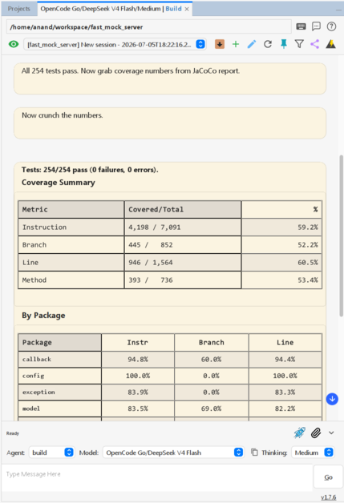
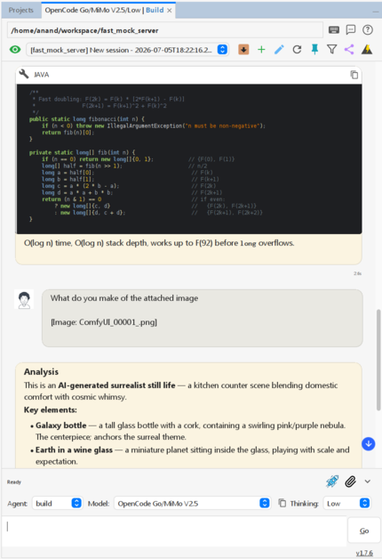
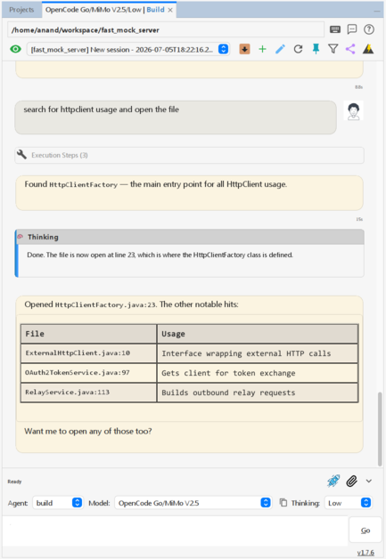

# Coding Assistant

[](pom.xml)
[](https://github.com/anandb/nb-complete)
[](https://central.sonatype.com/artifact/io.github.anandb/beanbot/versions)
[](https://netbeans.apache.org/download/index.html)
[](http://www.apache.org/licenses/LICENSE-2.0)
[](https://opencode.ai/go?ref=DWTNHGN9KX)

Coding Assistant is a NetBeans IDE plugin designed to provide integrated AI capabilities through the Agent Client Protocol (ACP). It offers a structured chat interface for technical assistance, including code generation, project analysis, and automated task execution.

| | | |
| :---: | :---: | :---: |
|  |  |  |

---

## Getting Started

See the [Quickstart Guide](QUICKSTART.md) for setup, feature details, and usage instructions.

### Test Configuration

Due to time constraints, testing is primarily done on this configuration. The plugin
should work on other versions/operating systems, but your experience may vary.

| Component | Details |
| --- | --- |
| **OS** | openSUSE Tumbleweed-Slowroll |
| **NetBeans** | RELEASE220 |
| **Java** | JDK 17+ |
| **Opencode** | 1.17.17 |
| **Opencode plugins** | `@franzmoca/opencode-lombok`, `true-mem` |
| **LLMs** | Big Pickle; GPT 5.4-mini, GPT 5.4-nano; GLM 5.1, GLM 5.2; DeepSeek V4 Pro, DeepSeek V4 Flash; Kimi K2.5, Kimi K2.6; Mimo V2.5; Qwen3.5, Qwen3.6; Gemma4 |

Note: Qwen models require `--think=false` if using Ollama, and a `"reasoningEffort": "none"`
configuration in `opencode.json`

### Installation from Source
1. Clone the repository:
   ```bash
   git clone https://github.com/anandb/nb-complete.git
   cd nb-complete
   ```
2. Build the package:
   ```bash
   mvn package -DskipTests
   ```
3. The generated NBM will be located in the `./target/nbm/` directory.
4. Install the plugin through the NetBeans Plugin Manager.

---

## Architecture

The project follows a hexagonal (ports & adapters) architecture integrated into the NetBeans Platform:

- **`model/`**: ACP-compliant data records (sessions, messages, updates, config options). Zero dependencies on upper layers.
- **`contract/`**: Service interfaces that define ports for session control, process management, and UI callbacks. `manager/` implements; `ui/` consumes.
- **`manager/`**: Core orchestration — protocol client (JSON-RPC over stdin/stdout), session state machine, process lifecycle, and SSE strategy dispatch.
- **`mcp/`**: MCP server integration — hosts a local server that registers IDE tools (`get_tabs`, `open_pos`, `rename_session`) so that the AI client can inspect open tabs and control editor navigation.
- **`support/`**: Pure utilities — logging, JSON mapping, text scanning, constants, browser helpers. Zero dependencies on upper layers.
- **`ui/`**: All Swing components — chat window, message bubbles, streaming animation, theming, options panel, stash diff viewer. Depends only on `contract/` interfaces.

---

## Source Organization

All source lives under `src/main/java/github/anandb/netbeans/`:

| Package | Files | Role |
| --- | --- | --- |
| `contract/` | 18 | Service interfaces (UI callbacks, session & process control, permission & request handlers, pinned message control) |
| `manager/` | 16 | Core orchestration, protocol clients, session management, process lifecycle (includes `strategy/`, file cache, VCS ignore) |
| `mcp/` | 11 | MCP server integration (editor tools, tool definitions, message servlet) |
| `model/` | 15 | ACP-compliant data models (session, messages, updates, config options, color tokens) |
| `project/` | 12 | NetBeans lifecycle hooks, project manager, markdown project support |
| `support/` | 17 | Utilities (logging, JSON mapping, text scanning, constants, browser helpers, pinned message store, shortcut utils) |
| `ui/` | 90 | Swing components, platform integration, markdown project UI (chat, bubbles, theming, options, stash diff, file search) |

---

## Code Reading Path

For a guided walkthrough mapped to the plugin's execution flow, read files in this order:

### Phase 1: Entry & Lifecycle
1. [`project/ACPStartup.java`](src/main/java/github/anandb/netbeans/project/ACPStartup.java) — NetBeans `@OnStart` hook
2. [`project/ACPShutdown.java`](src/main/java/github/anandb/netbeans/project/ACPShutdown.java) — `@OnStop` cleanup
3. [`src/main/resources/github/anandb/netbeans/ui/layer.xml`](src/main/resources/github/anandb/netbeans/ui/layer.xml) — NetBeans registration (window, shortcut, options, Git toolbar)

### Phase 2: Server Process
4. [`manager/ProcessManager.java`](src/main/java/github/anandb/netbeans/manager/ProcessManager.java) — Spawns/owns the `opencode acp` subprocess; central request dispatch
5. [`support/BinaryResolver.java`](src/main/java/github/anandb/netbeans/support/BinaryResolver.java) — Locates the binary on PATH
6. [`manager/AcpProtocolClient.java`](src/main/java/github/anandb/netbeans/manager/AcpProtocolClient.java) — JSON-RPC over stdin/stdout, SSE read loop, pending request tracking

### Phase 3: Session Management
7. [`manager/SessionManager.java`](src/main/java/github/anandb/netbeans/manager/SessionManager.java) — Session CRUD, state machine, SSE routing
8. [`manager/SessionStateMachine.java`](src/main/java/github/anandb/netbeans/manager/SessionStateMachine.java) — Finite-state machine for session lifecycle
9. [`model/Session.java`](src/main/java/github/anandb/netbeans/model/Session.java) — Session data record
10. [`model/SessionUpdate.java`](src/main/java/github/anandb/netbeans/model/SessionUpdate.java) — SSE notification payload model
11. [`model/Message.java`](src/main/java/github/anandb/netbeans/model/Message.java) — Message model (prompts, tool calls, results)

### Phase 4: Strategy Dispatch (SSE handler chain)
13. [`contract/UIHandler.java`](src/main/java/github/anandb/netbeans/contract/UIHandler.java) — Callback interface for rendering
14. [`manager/strategy/StrategyRegistry.java`](src/main/java/github/anandb/netbeans/manager/strategy/StrategyRegistry.java) — Sole dispatch class: type switch routes `SessionUpdate` → extraction logic, eliminating the strategy interface hierarchy

### Phase 5: UI Rendering
15. [`ui/AssistantTopComponent.java`](src/main/java/github/anandb/netbeans/ui/AssistantTopComponent.java) — Main chat window (NetBeans TopComponent)
16. [`ui/ComponentLifecycleHandler.java`](src/main/java/github/anandb/netbeans/ui/ComponentLifecycleHandler.java) — Wires lifecycle events → managers
17. [`ui/SessionLifecycleHandler.java`](src/main/java/github/anandb/netbeans/ui/SessionLifecycleHandler.java) — Glue: receives SSE updates, calls `StrategyRegistry.handle()`, invokes UI
18. [`ui/ChatThreadPanel.java`](src/main/java/github/anandb/netbeans/ui/ChatThreadPanel.java) — Thread of message bubbles with streaming animation
19. [`ui/MessageBubble.java`](src/main/java/github/anandb/netbeans/ui/MessageBubble.java) — Individual message turn (thought, tool, code segments)
20. [`ui/MessageSender.java`](src/main/java/github/anandb/netbeans/ui/MessageSender.java) — Send/cancel logic

### Phase 6: Supporting
21. [`model/ProcessedMessage.java`](src/main/java/github/anandb/netbeans/model/ProcessedMessage.java) — The rendered output model consumed by UI
22. [`mcp/McpManager.java`](src/main/java/github/anandb/netbeans/mcp/McpManager.java) — MCP server integration layer
23. [`contract/RequestHandler.java`](src/main/java/github/anandb/netbeans/contract/RequestHandler.java) — Interface for incoming RPC requests from the server

---

## System Properties

The plugin reads the following system properties and environment variables:

| Property | System | Description |
|---|---|---|
| `user.dir` | System | Working directory for session/project (`SessionManager`) |
| `user.home` | System | Default folder for Markdown Project creation (`MdProjectPanelVisual`) |
| `java.io.tmpdir` | System | Temp directory for pasted images (`ImagePasteTransferHandler`) |
| `os.name` | System | Detect Windows for binary resolution (`BinaryResolver`) |
| `netbeans.codingassistant.roundedPanels` | System (`true`) | Toggle rounded panel corners (`RoundedPanel`) |
| `netbeans.codingassistant.color.*` | System (varies) | Override any UI color (`ColorTheme`) |
| `nb.dark.theme` | UIManager | Detect dark theme for icon resolution (`IconResourceManager`) |
| `ACP_WIRE_LOG` | Env | Path for ACP wire protocol log file (`WireLogger`) |
| `OPENCODE_MODEL` | Env | Default model override in config (`ConfigPanelController`) |
| `PATH` | Env | Search path for opencode binary (`BinaryResolver`) |

The color properties are declared in [`colors.json`](src/main/resources/github/anandb/netbeans/ui/colors.json) and cover: background, foreground, selection, accent, sunken background, bubble (user/assistant), code, table, header, thinking, tool, permission, and error colors — each with light and dark variants.

---

## Contributing

Development follows standard NetBeans Platform patterns. Contributors are expected to maintain consistency with existing styling and logging conventions. New components must be validated against both light and dark IDE themes.

---

## License

This software is released under the Apache License, Version 2.0. Further details can be found in the LICENSE file.

---

Sign up for [OpenCode Go](https://opencode.ai/go?ref=DWTNHGN9KX) 🚀

