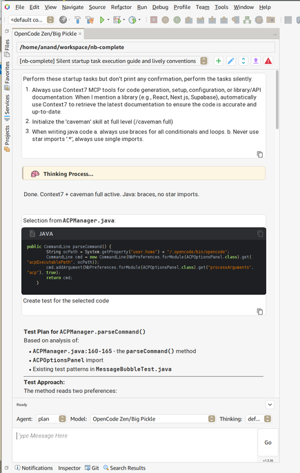
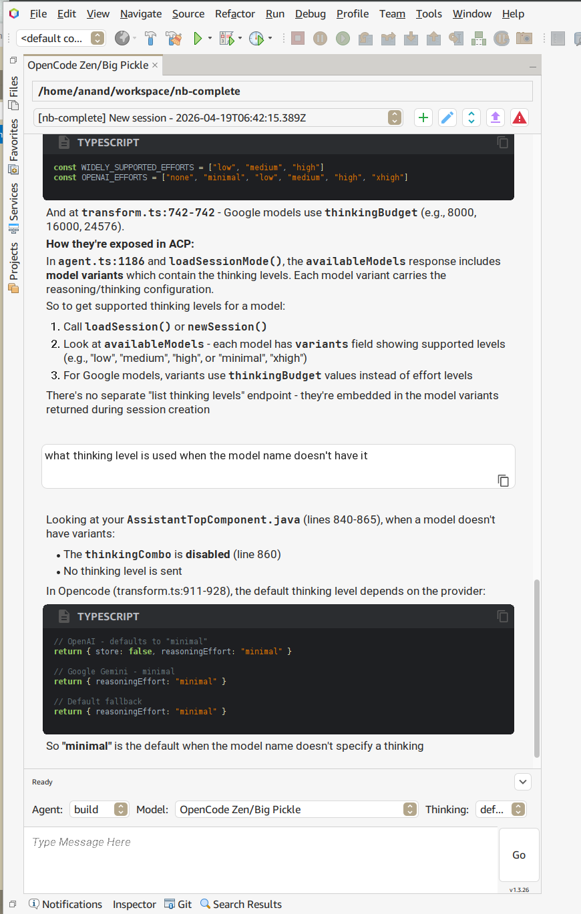

# Coding Assistant

[](pom.xml)
[](https://github.com/anandb/nb-complete)
[](https://central.sonatype.com/artifact/io.github.anandb/beanbot/versions)
[](https://netbeans.apache.org/download/index.html)
[](http://unlicense.org/)

The Coding Assistant is a NetBeans IDE plugin designed to provide integrated AI capabilities through the Agent Client Protocol (ACP). It offers a structured chat interface for technical assistance, including code generation, project analysis, and automated task execution.

| | |
| :---: | :---: |
|  |  |

---

## Getting Started

See the [Quickstart Guide](QUICKSTART.md) for setup, feature details, and usage instructions.

### Test Configuration

Due to time constraints, testing is primarily done on this configuration. The plugin
should work on other versions, but your experience may vary.

| Component | Details |
| --- | --- |
| **OS** | openSUSE Tumbleweed-Slowroll |
| **NetBeans** | RELEASE290 |
| **Java** | JDK 17+ |
| **Opencode** | 1.14.46 |
| **Opencode plugins** | `@franzmoca/opencode-lombok`, `@tarquinen/opencode-dcp@latest`, `@opencode/mcp-git` |
| **This Plugin Version** | ≥ v1.5.23 |
| **LLMs** | Big Pickle; GPT 5.4-mini, GPT 5.4-nano; DeepSeek V4 Pro, DeepSeek V4 Flash; Kimi K2.5, Kimi K2.6; Mimo V2.5; Qwen3.5, Qwen3.6 |

Note: Qwen models require `--think=false` if using Ollama, and a `"reasoningEffort": "none"`
configuration in `opencode.json`

### Installation from Source
1. Clone the repository:
   ```bash
   git clone https://github.com/anandb/nb-complete.git
   cd nb-complete
   ```
2. Build the package:
   ```bash
   mvn package -DskipTests
   ```
3. The generated NBM will be located in the `./target/nbm/` directory.
4. Install the plugin through the NetBeans Plugin Manager.

---

## Architecture

The project follows an event-driven architecture integrated into the NetBeans Platform:

- **Management Layer**: Handles the lifecycle of the communication process and service discovery.
- **Protocol Layer**: Manages JSON-RPC communication and session state transitions.
- **Streaming Service**: Processes real-time data feeds for the user interface.
- **UI Components**: Provides specialized Swing-based components for chat rendering and interaction.
- **Theme System**: Ensures visual consistency with the host IDE environment.

---

## Source Organization

- `src/main/java/github/anandb/netbeans/`
  - `manager/`: Core orchestration and protocol clients.
  - `model/`: Data models compliant with the ACP specification.
  - `project/`: Workspace and project API integration.
  - `ui/`: Interface components and theme management.

---

## Contributing

Development follows standard NetBeans Platform patterns. Contributors are expected to maintain consistency with existing styling and logging conventions. New components must be validated against both light and dark IDE themes.

---

## License

This software is released under the UNLICENSE. Further details can be found in the LICENSE file.
