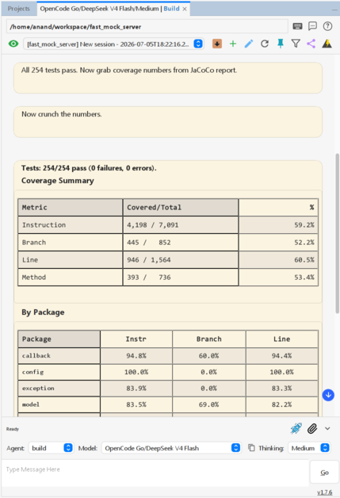
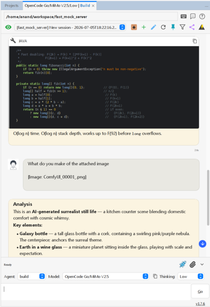
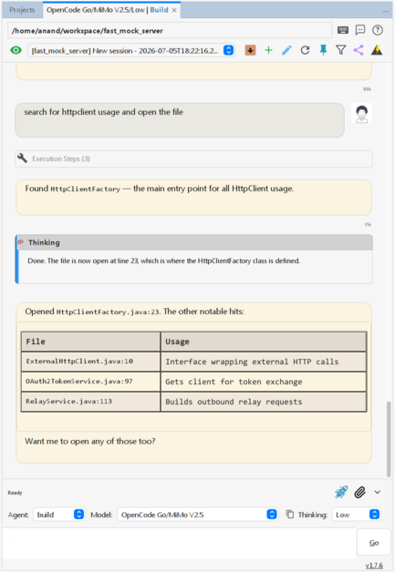

# BeanBot

[](pom.xml)
[](https://github.com/anandb/nb-complete)
[](https://central.sonatype.com/artifact/io.github.anandb/beanbot/versions)
[](https://netbeans.apache.org/download/index.html)
[](http://www.apache.org/licenses/LICENSE-2.0)

> **An AI pair programmer that lives inside your NetBeans editor — ask, explain, generate, and refactor code without leaving the IDE.**

BeanBot is a NetBeans IDE plugin designed to provide integrated AI capabilities through the Agent Client Protocol (ACP). It offers a structured chat interface for technical assistance, including code generation, project analysis, and automated task execution.

| | | |
| :---: | :---: | :---: |
|  |  |  |

---

## Getting Started

See the [User Guide](https://anandb.github.io/beanbot_user_guide.html) for setup, feature details, and usage instructions.

Supported coding harnesses: **Oh My Pi, OpenCode, OpenClaw, Pi, Goose, Cursor, Claude, Hermes, Gemini, Devin** — pick one during onboarding or later from the help menu.

### Test Configuration

Due to time constraints, testing is primarily done on this configuration. The plugin
should work on other versions/operating systems, but your experience may vary.

| Component | Details |
| --- | --- |
| **OS** | openSUSE Tumbleweed-Slowroll |
| **NetBeans** | RELEASE220 |
| **Java** | JDK 17+ |
| **Oh My Pi** | 18.1.21 |
| **Opencode** | 1.18.15 |
| **Opencode plugins** | `@franzmoca/opencode-lombok`, `true-mem` |
| **LLMs** | Big Pickle; GPT 5.4-mini, GPT 5.4-nano; GLM 5.1, GLM 5.2; DeepSeek V4 Pro, DeepSeek V4 Flash; Kimi K2.5, Kimi K2.6; Mimo V2.5; Qwen3.5, Qwen3.6; Gemma4 |

Note: Qwen models require `--think=false` if using Ollama, and a `"reasoningEffort": "none"`
configuration in `opencode.json`

### Installation from Source
1. Clone the repository:
   ```bash
   git clone https://github.com/anandb/nb-complete.git
   cd nb-complete
   ```
2. Build the package:
   ```bash
   mvn package -DskipTests
   ```
3. The generated NBM will be located in the `./target/nbm/` directory.
4. Install the plugin through the NetBeans Plugin Manager.

---

## Architecture

The project follows a hexagonal (ports & adapters) architecture integrated into the NetBeans Platform:

- **`model/`**: ACP-compliant data records (sessions, messages, updates, config options). Zero dependencies on upper layers.
- **`contract/`**: Service interfaces that define ports for session control, process management, and UI callbacks. `manager/` implements; `ui/` consumes.
- **`manager/`**: Core orchestration — protocol client (JSON-RPC over stdin/stdout), session state machine, process lifecycle, and SSE strategy dispatch.
- **`mcp/`**: MCP server integration — hosts a local server that registers the IDE tool set (editor context and navigation, filesystem, git/hg, tasks, projects, stash diff) so that the AI client can inspect open tabs and control editor navigation.
- **`project/`**: NetBeans lifecycle hooks (`@OnStart`/`@OnStop`), the open-project manager, and the markdown project type.
- **`tasks/`**: todo.txt task repository integration — bugtracking providers, issue cache, task editors.
- **`support/`**: Pure utilities — logging, JSON mapping, text scanning, constants, browser helpers. Zero dependencies on upper layers.
- **`ui/`**: All Swing components — chat window, message bubbles, streaming animation, theming, options panel, stash diff viewer. Depends on `contract/` interfaces, plus `model/` data records, `support/` utilities, and — through the `ui/platform/` bridge only — the `project/` layer. Never imports `manager/` or `mcp/`.

### Layer Dependencies

Dependencies flow downward only — no upward imports between layers:

```
        ┌─────────┐
        │   ui/   │  ← presentation (highest)
        └────┬────┘
             │
        ┌────▼────┐
        │manager/ │  ← business logic
        └────┬────┘
             │
    ┌────────┼────────┐
    ▼        ▼        ▼
┌────────┐ ┌────────┐ ┌────────┐
│ model/ │ │contract│ │support/│  ← data, interfaces, utils (lowest)
└────────┘ └────────┘ └────────┘
```

### Connection Flow

```
┌──────────┐    SSE / JSON-RPC    ┌───────────────────┐
│  Sidebar │ ◄──────────────────► │ AcpProtocolClient │
│ (client) │     stdin/stdout     │    (transport)    │
└──────────┘                      └────────┬──────────┘
                                           │
                                      ┌────▼──────┐
                                      │ ProcessMgr│
                                      │ (dispatch)│
                                      └────┬──────┘
                                           │
                                      ┌────▼──────┐
                                      │SessionMgr │
                                      │ (session) │
                                      └────┬──────┘
                                           │
                              ┌─────────────┼─────────────┐
                              ▼             ▼             ▼
                        ┌──────────┐  ┌──────────┐  ┌──────────┐
                        │ Strategy │  │ Lifecycle│  │   MCP    │
                        │ Registry │  │ Handler  │  │  Server  │
                        └──────────┘  └──────────┘  └──────────┘
```

`project/`, `mcp/`, and `tasks/` sit outside this five-layer model: `project/` is NetBeans
lifecycle wiring, `mcp/` is the tool-serving adapter surface, and `tasks/` is a self-contained
bugtracking feature. `model/`, `contract/`, and `support/` import none of them; `manager/`
reaches `mcp/` only from `ProcessManager` (via `McpManager`/`McpToolAdapter`).

---

## Source Organization

All source lives under `src/main/java/github/anandb/netbeans/`:

| Package | Files | Role |
| --- | --- | --- |
| `contract/` | 23 | Service interfaces (UI callbacks, session & process control, permission & request handlers, pinned message control) |
| `manager/` | 22 | Core orchestration, protocol clients, session management, process lifecycle (includes `strategy/`, file cache, VCS ignore) |
| `mcp/` | 41 | MCP server integration (editor, filesystem, VCS, task and project tool providers, tool input records, message servlet) |
| `model/` | 25 | ACP-compliant data models (session, messages, updates, config options, color tokens) |
| `project/` | 12 | NetBeans lifecycle hooks, project manager (includes `mdproject/`, the markdown project type) |
| `support/` | 27 | Utilities (logging, JSON mapping, text scanning, constants, browser helpers, pinned message store, shortcut utils) |
| `tasks/` | 17 | todo.txt task repository integration (bugtracking providers, issue cache, task editors) |
| `ui/` | 120 | Swing components, platform integration, markdown project UI (chat, bubbles, theming, options, stash diff, file search, send-to-assistant actions) |

---

## Code Reading Path

For a guided walkthrough mapped to the plugin's execution flow, read files in this order:

### Phase 1: Entry & Lifecycle
1. [`project/ACPStartup.java`](src/main/java/github/anandb/netbeans/project/ACPStartup.java) — NetBeans `@OnStart` hook
2. [`project/ACPShutdown.java`](src/main/java/github/anandb/netbeans/project/ACPShutdown.java) — `@OnStop` cleanup
3. [`src/main/resources/github/anandb/netbeans/ui/layer.xml`](src/main/resources/github/anandb/netbeans/ui/layer.xml) — NetBeans registration (window menu/shortcuts, editor popup, Git toolbar); the Options panel is registered by annotation in `ui/ACPOptionsPanelController.java`

### Phase 2: Server Process
4. [`manager/ProcessManager.java`](src/main/java/github/anandb/netbeans/manager/ProcessManager.java) — Owns the ACP server subprocess and acts as the central request-dispatch hub; spawn itself is in `manager/ServerProcessLifecycle.startServer()`, launching the harness binary the user selected (10 supported)
5. [`support/BinaryResolver.java`](src/main/java/github/anandb/netbeans/support/BinaryResolver.java) — Locates the binary on PATH
6. [`manager/AcpProtocolClient.java`](src/main/java/github/anandb/netbeans/manager/AcpProtocolClient.java) — JSON-RPC over stdin/stdout, SSE read loop, pending request tracking

### Phase 3: Session Management
7. [`manager/SessionManager.java`](src/main/java/github/anandb/netbeans/manager/SessionManager.java) — Session CRUD, state machine, SSE routing
8. [`manager/SessionStateMachine.java`](src/main/java/github/anandb/netbeans/manager/SessionStateMachine.java) — Finite-state machine for session lifecycle
9. [`model/Session.java`](src/main/java/github/anandb/netbeans/model/Session.java) — Session data record
10. [`model/SessionUpdate.java`](src/main/java/github/anandb/netbeans/model/SessionUpdate.java) — SSE notification payload model
11. [`model/Message.java`](src/main/java/github/anandb/netbeans/model/Message.java) — Message model (prompts, tool calls, results)

### Phase 4: Strategy Dispatch (SSE handler chain)
12. [`contract/UIHandler.java`](src/main/java/github/anandb/netbeans/contract/UIHandler.java) — Callback interface for rendering
13. [`manager/strategy/StrategyRegistry.java`](src/main/java/github/anandb/netbeans/manager/strategy/StrategyRegistry.java) — Sole dispatch class: type switch routes `SessionUpdate` → extraction logic, eliminating the strategy interface hierarchy

### Phase 5: UI Rendering
14. [`ui/AssistantTopComponent.java`](src/main/java/github/anandb/netbeans/ui/AssistantTopComponent.java) — Main chat window (NetBeans TopComponent)
15. [`ui/ComponentLifecycleHandler.java`](src/main/java/github/anandb/netbeans/ui/ComponentLifecycleHandler.java) — Wires lifecycle events → managers
16. [`ui/SessionLifecycleHandler.java`](src/main/java/github/anandb/netbeans/ui/SessionLifecycleHandler.java) — Glue: receives SSE updates, calls `StrategyRegistry.handle()`, invokes UI
17. [`ui/ChatThreadPanel.java`](src/main/java/github/anandb/netbeans/ui/ChatThreadPanel.java) — Thread of message bubbles with streaming animation
18. [`ui/MessageBubble.java`](src/main/java/github/anandb/netbeans/ui/MessageBubble.java) — Individual message turn (thought, tool, code segments)
19. [`ui/MessageSender.java`](src/main/java/github/anandb/netbeans/ui/MessageSender.java) — Send/cancel logic

### Phase 6: Supporting
20. [`model/ProcessedMessage.java`](src/main/java/github/anandb/netbeans/model/ProcessedMessage.java) — The rendered output model consumed by UI
21. [`mcp/McpManager.java`](src/main/java/github/anandb/netbeans/mcp/McpManager.java) — MCP server integration layer
22. [`contract/RequestHandler.java`](src/main/java/github/anandb/netbeans/contract/RequestHandler.java) — Interface for incoming RPC requests from the server

---

## System Properties

The plugin reads the following system properties and environment variables:

| Property | System | Description |
|---|---|---|
| `user.dir` | System | **Not used.** `SessionManager` deliberately fails fast instead of falling back to the IDE launcher directory (`createSession` requires an explicit project `cwd`) |
| `user.home` | System | Default folder for Markdown Project creation (`MdProjectPanelVisual`) |
| `java.io.tmpdir` | System | Temp directory for pasted images (`ImagePasteTransferHandler`) |
| `os.name` | System | Detect Windows for binary resolution and platform-specific launching (`BinaryResolver`, `ProcessTerminator`, `ACPOptionsPanel`) |
| `beanbot.roundedPanels` | System (`true`) | Toggle rounded panel corners (`RoundedPanel`) |
| `beanbot.fs.write.enabled` | System (`true`) | ACP-only: gates the `fs/writeTextFile` / `fs/write_text_file` ACP tools (`FsWriteSettings`). MCP write tools (`write_to_file`, `replace_lines`, `insert_in_file`) are always confined to open projects and unaffected by this property. Set `-Dbeanbot.fs.write.enabled=false` to stop advertising the ACP write capability and reject every ACP write |
| `beanbot.color.*` | System (varies) | Override any UI color. Read by `model/ColorRegistry` (resolution order: system property → `UIManager` key → built-in light/dark fallback), not by `ColorTheme`, which only loads `colors.json` |
| `nb.dark.theme` | UIManager | Detect dark theme for icon resolution (`IconResourceManager`) |
| `ACP_WIRE_LOG` | Env | Path for ACP wire protocol log file (`WireLogger`) |
| `PATH` | Env | Search path for the harness binary; all 10 supported harness names are probed (`BinaryResolver`) |

The color properties are declared in [`colors.json`](src/main/resources/github/anandb/netbeans/ui/colors.json) and cover: background, foreground, selection, accent, sunken background, bubble (user/assistant), code, table, header, thinking, tool, permission, and error colors. Most entries define both light and dark variants; the ones resolved straight from a `UIManager` key or a single fallback (`foreground`, `sunkenBackground`, `codeBackground`, `codeForeground`, `codeSelection`) do not.

---

## Tasks File Format

BeanBot's **Tasks** repositories are stored as plain [todo.txt](https://github.com/todotxt/todo.txt) files, so they are readable and editable with any standard todo.txt tool. Each task is one line; the format builds on the todo.txt spec and adds a small set of BeanBot-specific extensions.

### Line layout

```
x (B) 2026-08-02 2026-08-01 Fix the bug @urgent @bug +myproject due:2026-09-01 id:t-1a2b3c4d estimate:5 consumed:2 upd:2026-08-02T10:00:00Z
```

| Position / token | Meaning |
| --- | --- |
| `x ` (optional) | Marks the task **closed**. Its absence means **open** (open is the implicit default — there is no `status:` token). |
| `(A)`–`(Z)` | Priority letter, immediately after `x ` or as the first token when open. Native todo.txt syntax; only one letter. |
| `YYYY-MM-DD` | Up to two positional dates **before the summary**: a completion date (only when `x ` is present) followed by the creation date. Date-only. |
| *summary* | Free text, preserved verbatim on save. |
| `@word` | A **tag** (e.g. `@urgent`). |
| `+word` | A **project** (e.g. `+myproject`). |
| `due:YYYY-MM-DD` | Due date (standard todo.txt `due:` extension). |
| `id:t-XXXXXXXX` | Stable task id. If a line has no `id:`, BeanBot assigns one in NetBeans format (`t-` + 8 hex chars), unique within the file. |
| `estimate:<int>` | Estimated effort in arbitrary user-inferred units. |
| `consumed:<int>` | Consumed effort in the same units. |
| `upd:<iso>` | Last-modified timestamp (full ISO-8601), preserving edit time across saves. |

### Notes & conventions

- Tags and projects are stored **only** as `@`/`+` tokens — there is no redundant `tags:`/`projects:` mirror, so a load→save round-trip never duplicates them.
- `estimate`/`consumed` are integers representing **arbitrary, user-defined units** (BeanBot does not assign them meaning); they are for personal tracking only.
- Unknown tokens are tolerated on read: a token that is neither `@`/`+` nor a recognised `key:value` is absorbed back into the free-text summary, so files edited by other todo.txt tools remain readable.
- Lines with no parseable content (blank lines) are skipped. A line without an `id:` token is still parsed — a fresh id is generated for it.

### Troubleshooting

| Problem | Solution |
| --- | --- |
| Plugin can't find the harness | Use the harness chooser to pick an installed harness, copy its install command, or set the path manually under `Options > Assistant`. Binaries found on `PATH` are never auto-selected — you always make the choice. |
| Assistant becomes unresponsive | Click **Restart Harness** in the toolbar. |
| Ctrl + L stops working | Close and reopen the assistant panel from the Window menu. If that doesn't work, restart the IDE. |
| Sidebar doesn't open after install/upgrade | The plugin auto-opens the sidebar on version change. If it doesn't appear, open it from `Window > Assistant`. |
| Image paste doesn't work with Wayland on Linux | Install the `wl-clipboard` package (Wayland) or check your clipboard manager. |
| Image paste broken after OpenCode upgrade | Upgrade to OpenCode >= 1.17.17 to resolve the breakage introduced in v1.17.13. |
| Model not appearing after an OpenCode upgrade | Re-select your model via `/models`. An upgrade that changes the `thought_level` split resets model selection. |
| Session config payloads restructured after upgrade | Upgrade to BeanBot >= 1.21.1 and OpenCode >= 1.17.17. Re-select your model and review any custom preamble or session settings. |
| Messages disappear from view | This is display-only — the session still has all messages. Click **Show All Messages** to keep them visible, and use **Reload** to re-fetch from the server. |
| LLM modified files unexpectedly | Keep your project under version control so you can revert changes you don't want. You can also set OpenCode to 'ask' before editing, and review changes with the **Allow Once/Always Allow/Reject** permission prompts. |
| Panel goes blank during docking or resizing | Close and reopen the docked panel from `Window > Assistant`. NetBeans may not repaint correctly after a drag-dock or undock operation. |

### Known Issues/Limitations

- Opencode sometimes doesn't respond when using nested agents.
- The plugin supports only one active session at a time, switching sessions or reloading the conversation while awaiting a response will cancel the current request.
- Permission requests from subagents (delegated agents) aren't always relayed by some harnesses back to the UI. If a subagent makes a tool call that requires permission, the request may hang and eventually time out because you never receive the Accept/Deny prompt. To mitigate this, instruct your primary agent to perform file modifications or commands directly rather than asking it to delegate those tasks to a subagent. The mini-assistant also shows permission prompts — check whether it is visible if the main sidebar doesn't show one.
- A few harnesses like Pi write directly to files; the pi-permission extension can gate some of those actions.

---

## Contributing

Development follows standard NetBeans Platform patterns. Contributors are expected to maintain consistency with existing styling and logging conventions. New components must be validated against both light and dark IDE themes.

---

## License

This software is released under the Apache License, Version 2.0. Further details can be found in the LICENSE file.

